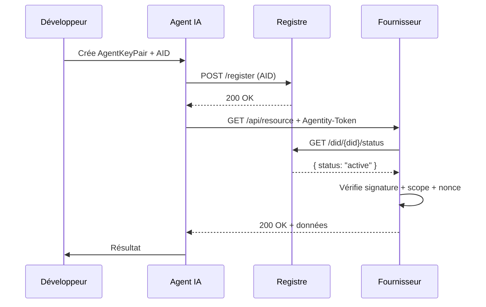

# Agentity Protocol Specification — v0.1

## 1. DID Method: `did:agentity`

Format : `did:agentity:agent:<base58-fingerprint>`

Le fingerprint est le hash SHA-256 de la clé publique Ed25519, encodé en base58.

Exemple :
did:agentity:agent:7Xj3mK9pL2nQ8vRtYwZb4cFdHsNaEgUi

Types de DID supportés :
- `did:agentity:agent:<fingerprint>` — Agent IA autonome
- `did:agentity:human:<fingerprint>` — Humain propriétaire
- `did:agentity:org:<fingerprint>` — Organisation
- `did:agentity:provider:<fingerprint>` — Fournisseur de service

## 2. Agent Identity Document (AID)

```json
{
  "did": "did:agentity:agent:7Xj3mK9pL2nQ8vRtYwZb4cFdHsNaEgUi",
  "version": "1",
  "specVersion": "0.1",
  "created": "2026-05-08T00:00:00Z",
  "expires": "2026-06-08T00:00:00Z",
  "owner": {
    "did": "did:agentity:human:ownerFingerprint",
    "type": "human"
  },
  "parent": null,
  "delegationDepth": 0,
  "model": {
    "provider": "anthropic",
    "name": "claude-sonnet-4-6",
    "version": "20251001"
  },
  "scope": [
    "stripe:payments:read",
    "calendar:events:write"
  ],
  "publicKey": {
    "type": "Ed25519VerificationKey2020",
    "value": "<base64url-encoded-public-key>"
  },
  "status": "active",
  "proof": {
    "type": "Ed25519Signature2020",
    "created": "2026-05-08T00:00:00Z",
    "proofValue": "<base64url-encoded-signature>"
  }
}
```

### Champs

| Champ | Description |
|-------|-------------|
| `did` | DID unique de l'agent |
| `version` | Version du document (incrémentée à chaque rotation) |
| `specVersion` | Version de la spec Agentity |
| `created` | Date de création ISO-8601 |
| `expires` | Date d'expiration ISO-8601 |
| `owner` | Propriétaire (humain ou organisation) |
| `parent` | DID du parent dans la chaîne de délégation |
| `delegationDepth` | Nombre de niveaux depuis le root owner (max 10) |
| `model` | Info sur le modèle IA (optionnel) |
| `scope` | Liste des scopes accordés |
| `publicKey` | Clé publique Ed25519 |
| `status` | Statut : active, revoked, expired |
| `proof` | Signature auto-certifiant le document |

## 3. Chaîne de délégation

- Chaque AID peut avoir un champ `parent` pointant vers le DID parent
- Un sous-agent ne peut pas déclarer des scopes absents de son parent
- La révocation d'un parent révoque tous ses enfants (cascade)
- Maximum 10 niveaux de délégation
- Le root owner est toujours un humain (`did:agentity:human:*`) ou une organisation (`did:agentity:org:*`)

## 4. Provider Manifest

Endpoint : `GET /.well-known/agentity-manifest.json`

```json
{
  "provider": "did:agentity:provider:<fingerprint>",
  "name": "Stripe",
  "description": "Payment processing API",
  "specVersion": "0.1",
  "baseUrl": "https://api.stripe.com",
  "scopes": [
    {
      "id": "stripe:payments:read",
      "description": "Lire les paiements",
      "risk": "low",
      "requires": []
    },
    {
      "id": "stripe:payments:write",
      "description": "Créer des paiements",
      "risk": "high",
      "requires": ["stripe:payments:read"]
    },
    {
      "id": "stripe:customers:read",
      "description": "Lire les informations clients",
      "risk": "medium",
      "requires": []
    }
  ],
  "signature": {
    "type": "Ed25519Signature2020",
    "created": "2026-05-08T00:00:00Z",
    "proofValue": "<base64url-encoded-signature>"
  }
}
```

### Hiérarchie des scopes

Les scopes suivent le format `provider:resource:action`.
- `*:*:*` — Tous les accès (admin)
- `stripe:*:*` — Tous les accès Stripe
- `stripe:payments:*` — Toutes les actions sur les paiements
- `stripe:payments:read` — Lecture seule des paiements

Un scope parent donne implicitement tous les sous-scopes.

## 5. Header HTTP de requête

Chaque requête d'un agent vers un fournisseur doit inclure :

```
Agentity-Token: <base64url(AID_json)>.<base64url(signature)>
Agentity-Nonce: <uuid-v4>
Agentity-Timestamp: <ISO-8601>
```

La signature couvre :
```
sha256(AID_did + nonce + timestamp + request_method + request_path + request_body_hash)
```

### Exemple

```
Agentity-Token: eyJkaWQiOiI...<base64 AID>.eyJzaWciOiI...<base64 sig>
Agentity-Nonce: 550e8400-e29b-41d4-a716-446655440000
Agentity-Timestamp: 2026-05-08T12:00:00Z
```

## 6. Statuts AID

| Statut | Description |
|--------|-------------|
| `active` | Valide, non révoqué, non expiré |
| `revoked` | Révoqué manuellement ou par cascade parent |
| `expired` | TTL dépassé |

Transitions autorisées :
- `active` → `revoked` (révocation manuelle)
- `active` → `expired` (TTL expiré)
- Toute transition est irréversible

## 7. Règles de vérification (côté fournisseur)

1. Décoder le token et extraire l'AID JSON + signature
2. Vérifier la signature avec la clé publique de l'AID
3. Vérifier le nonce (non rejoué dans les 5 dernières minutes)
4. Vérifier le timestamp (delta < 5 minutes)
5. Vérifier le statut via le registre (`active`)
6. Vérifier que les scopes de l'AID ⊆ scopes déclarés du fournisseur
7. Vérifier la chaîne de délégation (aucun parent révoqué)
8. Autoriser ou rejeter avec code HTTP 401/403

### Réponses HTTP

| Code | Signification |
|------|---------------|
| 200 | Requête autorisée |
| 401 | Token manquant ou mal formé |
| 403 | Signature invalide, scope insuffisant, ou agent révoqué |
| 429 | Trop de requêtes (rate limiting) |

## 8. API Registre

### GET /did/{did}
Retourne l'AID complet.

### GET /did/{did}/status
Retourne `{ "status": "active"|"revoked"|"expired", "updatedAt": "..." }`.

### POST /revoke
Corps : `{ "did": "...", "reason": "...", "cascade": true }`
Révoque un AID. Si `cascade: true`, révoque tous les descendants.

### GET /audit/{did}
Retourne l'historique des événements (création, révocation, rotation).

### WebSocket /ws
Émet des événements temps réel :
```json
{ "type": "revocation", "did": "did:agentity:agent:...", "timestamp": "..." }
```

## 9. Sécurité

### Anti-replay
- Chaque requête inclut un nonce UUID v4 unique
- Fenêtre de tolérance : 5 minutes
- Nonces stockés côté fournisseur avec TTL 5 minutes

### Rotation de clés
- Un nouvel AID est créé avec une nouvelle clé publique
- L'ancien AID est marqué `expired`
- Le nouveau document a `version + 1`
- Le lien entre ancien et nouveau AID est conservé dans l'audit log

### Rate Limiting
- Recommandation : 100 requêtes/minute par DID
- Header `Agentity-RateLimit-Remaining` dans les réponses

## 10. Exemple de flux complet



## CHANGELOG

### v0.1 — 2026-05-08
- Spécification initiale du protocole
- DID method `did:agentity`
- AID document format
- Chaîne de délégation (max 10 niveaux)
- Provider Manifest
- HTTP headers pour requêtes signées
- API Registre REST
- Règles de vérification complètes
